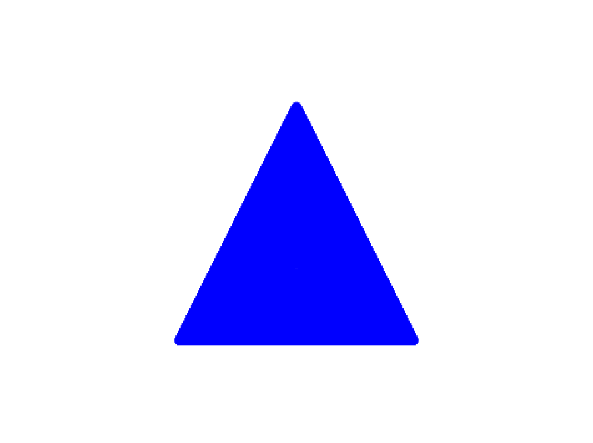

# draw_triangle

## Formules

Dans un triangles avec ses sommets aux coordonnées $(x_1, y_1)$, $(x_2, y_2)$ et $(x_3, y_3)$ :

Nous pouvons calculer les longueurs  $a$, $b$, $c$ de chaque coté et que le périmètre $p$ d'un triangle avec ces calculs simples :
$$
a = \sqrt{(x_2 - x_3) ^ 2 + (y_2 - y_3) ^ 2} \\
b = \sqrt{(x_3 - x_1) ^ 2 + (y_3 - y_1) ^ 2} \\
c = \sqrt{(x_1 - x_2) ^ 2 + (y_1 - y_2) ^ 2} \\
p = a + b + c
$$

Grâce à cela nous pouvons calculer l'air du triangle grâce à la formule d'Heron :
$$
s = \frac{p}{2} \\
A = \sqrt{ s \times (s - a) \times (s - b) \times (s - c)}
$$

Ainsi que les coordonnées $I$  et le rayon $r$ du cercle inscrit :
$$
I = (\frac{ax_1 + bx_2 + cx_3}{p}, \frac{ax_1 + bx_2 + cx_3}{p}) \\
A = \frac{r \times p}{2} \\
r = 2 \times \frac{A}{p}
$$

## Exemple

